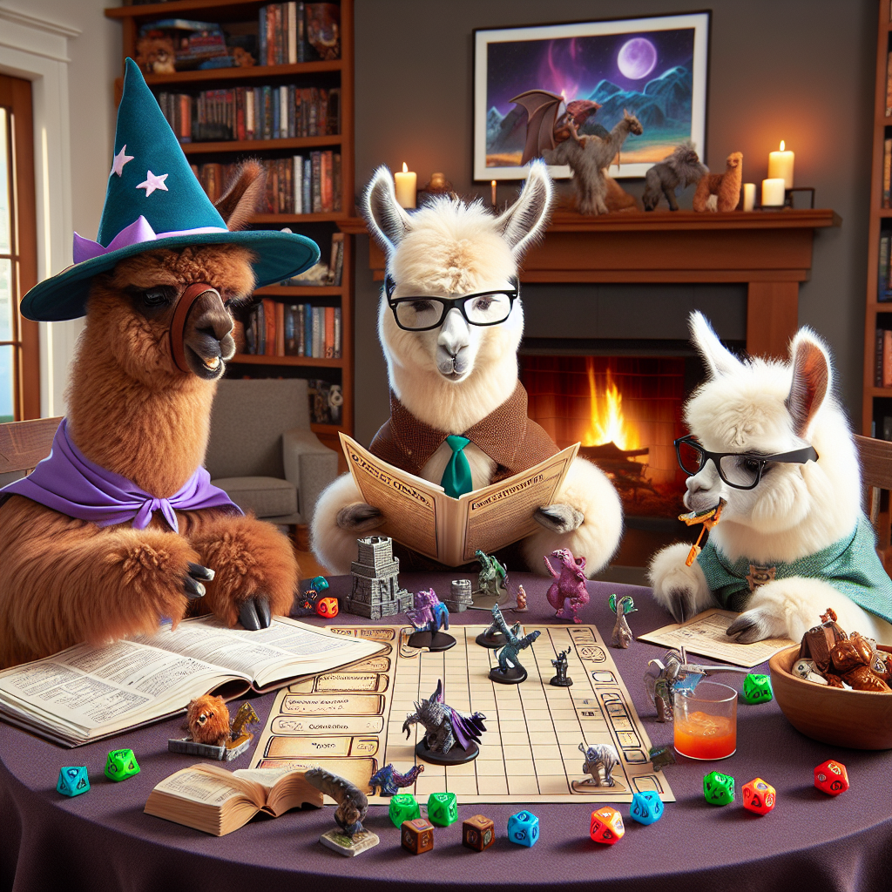

# DnD-Transformer: ✨ A Spark of Vision-Language Intelligence


<p align="center">
        🤗 <a href="https://huggingface.co/leonardPKU/DnD-Transformer">Model</a>&nbsp&nbsp | 🤗 <a href=""> Dataset (Coming Soon)</a>&nbsp&nbsp| &nbsp&nbsp📑 <a href="https://arxiv.org/abs/2410.01912">Paper</a> | &nbsp&nbsp💻<a href="https://github.com/chenllliang/DnD-Transformer"> Github</a>
</p>

<p align="center">

<p>

</div>

## Updates 🎈

- 2024-10-11: Release training code.
- 2024-10-8: Release models and inference code.
- 2024-10-4: Release paper.

<br>

<p align="center">


What's New?

1. A better AR image genenation paradigm and transformer model structure based on 2D autoregression. It generates images of higher quality without increasing computation budget.

2. A spark of vision-language intelligence for the first time, enabling unconditional rich-text image generation, outperforming diffusion models like DDPM and Stable Diffusion on dedicated rich-text image datasets, highlighting the distinct advantage of autoregressive models for multimodal modeling.
<p>


## Models

### DnD-Tokenizers (VQVAE-Checkpoints)

*ImageNet*

| Code Size | Codebook Size | Link | rFID |
|:---:|:---:|:---:|:---:|
| 16x16x2 | 16384 | [🤗](https://huggingface.co/leonardPKU/DnD-Transformer/tree/main/2d_tokenzier_imagenet) | 0.92 (256x256 f16 SoTA!) |
| 16x16x4 | 16384 | [🤗](https://huggingface.co/leonardPKU/DnD-Transformer/tree/main/2d_tokenizer_imagenet_depth4) | 0.60 (256x256 f16 SoTA!) |
| 32x32x2 | 16384 | [🤗](https://huggingface.co/leonardPKU/DnD-Transformer/tree/main/2d_tokenizer_imagenet512) | 0.42 (512x512 f16 SoTA!) |

*Text-Image*

| Code Size | Codebook Size | Link |
|:---:|:---:|:---:|
| 24x24x1 | 4096| [🤗](https://huggingface.co/leonardPKU/DnD-Transformer/tree/main/2d_tokenizer_text_image) |

*arXiv-Image*

| Code Size | Codebook Size | Link |
|:---:|:---:|:---:|
| 16x16x8 | 16384 | [🤗](https://huggingface.co/leonardPKU/DnD-Transformer/tree/main/2d_tokenizer_arxiv_image) |


### DnD-Transformers (GPT-Checkpoints)


*ImageNet*
| Code Shape | Image Size | Model Size | Link | gFID |
|:---:|:---:|:---:|:---:|:---:|
| 16x16x2 | 256x256 | XXL | [🤗](https://huggingface.co/leonardPKU/DnD-Transformer/tree/main/trained_dnd_transformer_imagenet_2layer/XXL) | 2.58 (cfg=2) |
| 16x16x2 | 256x256 | XXXL | [🤗](https://huggingface.co/leonardPKU/DnD-Transformer/tree/main/trained_dnd_transformer_imagenet_2layer/XXXL) | 2.21 (cfg=1.7) |


*Text-Image*
| Code Shape | Image Size | Model Size | Link | 
|:---:|:---:|:---:|:---:|
| 24x24x1 | 384x384 | XXL | [🤗](https://huggingface.co/leonardPKU/DnD-Transformer/tree/main/trained_dnd_transformer_text_image_1layer/XXL) |  


*arXiv-Image*
| Code Shape | Image Size | Model Size | Link | 
|:---:|:---:|:---:|:---:|
| 16x16x8 | 256x256 | XXL | [🤗](https://huggingface.co/leonardPKU/DnD-Transformer/tree/main/trained_dnd_transformer_arxiv_image_8layer/XXL) |  


## Setup

```bash
conda create -n DnD python=3.10
conda activate DnD
pip install -r requirements.txt
```


## Inference

**First download all vq-tokenizers and model checkpoints from  <a href="https://huggingface.co/leonardPKU/DnD-Transformer">🤗</a>**

*Sampling ImageNet Examples and Compute FID*
```bash
cd ./src
bash ./scripts/sampling_dnd_transformer_imagenet.sh # edit the address for vq model checkpoint and dnd-transformer checkpoint

# An npz would be saved after genearting 50k images, you can follow https://github.com/openai/guided-diffusion/tree/main/evaluations to compute the generated FID.
```

*Sampling Text-Image Examples*
```bash
cd ./src
bash ./scripts/sampling_dnd_transformer_text_image.sh # edit the address for vq model checkpoint and dnd-transformer checkpoint
```

*Sampling arXiv-Image Examples*
```bash
cd ./src
bash ./scripts/sampling_dnd_transformer_arxiv_image.sh # edit the address for vq model checkpoint and dnd-transformer checkpoint
```


## Training

### Training VQVAEs

We refer to [RQVAE](https://github.com/kakaobrain/rq-vae-transformer) for training the multi-depth VQVAEs.

### Extract Codes for Training

```bash
cd ./src
bash ./scripts/extract_codes_tencrop_c2i.sh
```


### Training DnD-Transformers

```bash
cd ./src
bash ./scripts/train_dnd_transformer_imagenet.sh
```

## Evaluation

### ReconstructionOCR (rOCR)

```bash
sh ./scripts/rOCR.sh
```

Or

```bash
python infer_gt_ModelParallel_qwen.py \
--batch_size 16 \
--gt_dir <gt_dir> \
--images_dir <images_dir> \
--model_dir <model_dir> \
--output_dir <output_dir>

python metrics.py \
--predict_dir <predict_dir> \
--gt_dir <gt_dir> \
--output_dir <output_dir>

```

### PPL-OCR
coming soon~


## Acknowledgements

Thanks to [RQVAE](https://github.com/kakaobrain/rq-vae-transformer) and [LlamaGen](https://github.com/FoundationVision/LlamaGen) for providing the open source codebase.

## Reference

```bib
@misc{chen2024sparkvisionlanguageintelligence2dimensional,
      title={A Spark of Vision-Language Intelligence: 2-Dimensional Autoregressive Transformer for Efficient Finegrained Image Generation}, 
      author={Liang Chen and Sinan Tan and Zefan Cai and Weichu Xie and Haozhe Zhao and Yichi Zhang and Junyang Lin and Jinze Bai and Tianyu Liu and Baobao Chang},
      year={2024},
      eprint={2410.01912},
      archivePrefix={arXiv},
      primaryClass={cs.CV},
      url={https://arxiv.org/abs/2410.01912}, 
}
```


